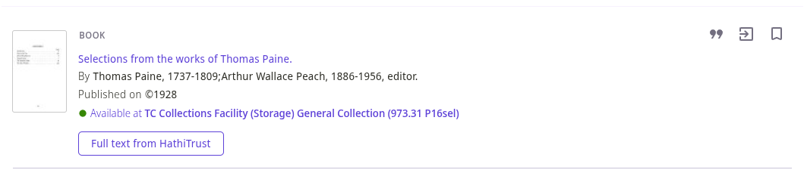

# Primo NDE HathiTrust Availability Add-on

NDE implementation of the [legacy Primo HathiTrust availability plugin](https://github.com/UMNLibraries/primo-explore-hathitrust-availability)

## Features

When a local (non-CDI) search result is displayed in Primo, the record's OCLC numbers (or other optional identifiers) are passed to the [HathiTrust Bib API](https://www.hathitrust.org/bib_api). If at least one item with free full-text access is found, a link to the HathiTrust record is appended to the availability section.

### Screenshot



## Add-on installation instructions

1. First, create a JSON configuration file for the plugin. It can be named however you like (e.g. `hathi-trust-config.json`). Add any configuration options to the file [as described below](#configuration-options). The default settings should work well for most institutions.

> [!NOTE]
> Primo requires you upload a configuration file for add-ons, so even if you're satisfied with the defaults, you'll need to create a configuration file with an empty JSON object: `{}`.

2. Next, navigate to the [add-on configuration page](<https://knowledge.exlibrisgroup.com/Primo/Product_Documentation/020Primo_VE/Primo_VE_(English)/120Other_Configurations/Managing_Add-Ons_for_the_NDE_UI>) in Primo/Alma. Add a new row, and specify the following values in each field:

- **Add-on Name**: `HathiTrust`
- **Add-on Configuration File**: _Upload the configuration file you created in the previous step._
- **View**: _Select which view(s) should show the HathiTrust add-on._
- **Add-on URL**: `https://primo-nde-hathi-trust-addon.pages.dev`

3. Click **Save**.

## Configuration options

| Option                       | Type    | Default | Description                                                                                                                                                                                                                                 |
| ---------------------------- | ------- | ------- | ------------------------------------------------------------------------------------------------------------------------------------------------------------------------------------------------------------------------------------------- |
| `disableWhenAvailableOnline` | boolean | true    | Don't check for HathiTrust availability if the record already has online access.                                                                                                                                                            |
| `disableForJournals`         | boolean | false   | Don't check for HathiTrust availability if the record type is a journal.                                                                                                                                                                    |
| `ignoreCopyright`            | boolean | false   | Display availability links on all records in HathiTrust, including works not in the public domain. Normally, you won't want to enable this unless [ETAS](https://www.hathitrust.org/member-libraries/services-programs/etas/) is in effect. |
| `matchOn.oclc`               | boolean | true    | Search HathiTrust using the record's OCLC number(s). This is usually the most reliable match point for HathiTrust records.                                                                                                                  |
| `matchOn.isbn`               | boolean | false   | Search HathiTrust using the record's ISBN(s).                                                                                                                                                                                               |
| `matchOn.issn`               | boolean | false   | Search HathiTrust using the record's ISSN(s).                                                                                                                                                                                               |
| `matchOn.lccn`               | boolean | false   | Search HathiTrust using the record's LCCNs(s).                                                                                                                                                                                              |

> [!TIP]
> You can enable any combination of `matchOn` identifiers, as long as at least one identifier is enabled.

### Example configuration JSON

```json
{
  "disableWhenAvailableOnline": true,
  "disableForJournals": false,
  "ignoreCopyright": false,
  "matchOn": {
    "oclc": true,
    "isbn": false,
    "issn": false,
    "lccn": false
  }
}
```

### Customizing the availability text

The default availability link text is: "Full text from HathiTrust"

To customize the availability text, add a row to the Primo VE **NDE Custom Defined Labels** code table with the code `HathiTrust.availabilityText` and a description of your choosing.
